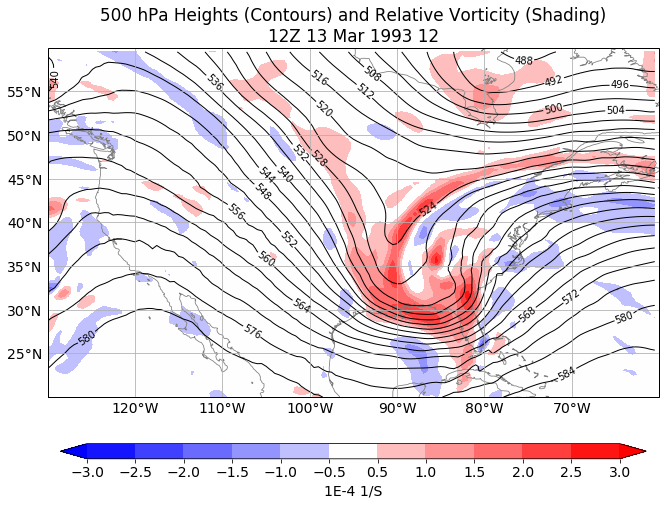
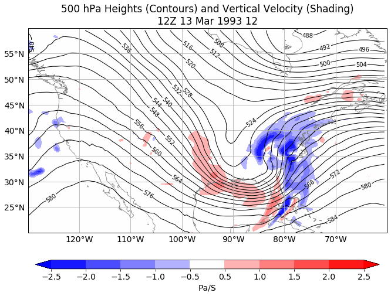
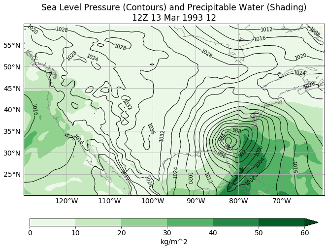

# weather_maps

This repository contains a python notebook for making basic weather maps from online data.  Should work for 1 Jan 1979 through the current time (the most recent available run of the GFS). 

This notebook is part of outreach activities for NSF projects AGS-1623912 and AGS-1657921.

You should also be able to run the notebook directly through binder and adjust the time and lat-lon region to whatever you like, either through clicking on the binder button:

or by using the link: https://mybinder.org/v2/gh/mathewbarlow/weather_maps/master?filepath=weather_maps.ipynb

It may take some time to load through binder.

This is an initial attempt, so if you find any bugs, please let me know at Mathew_Barlow@uml.edu.  Over time, I will be adding more variables and more plots, and improving the quality of the graphics.  Here are samples of the maps, for the March 1993 "Superstorm."

